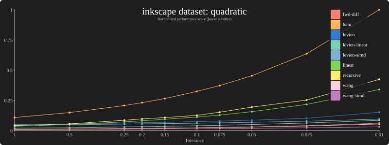
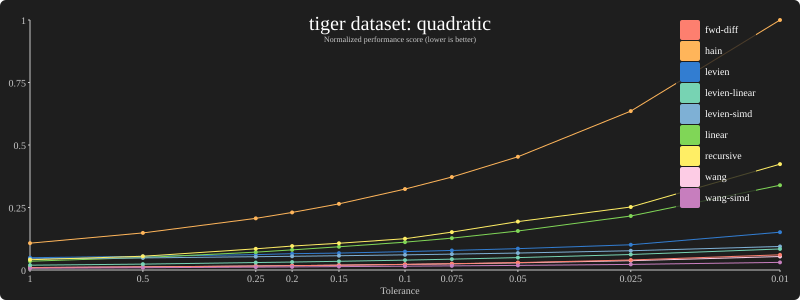
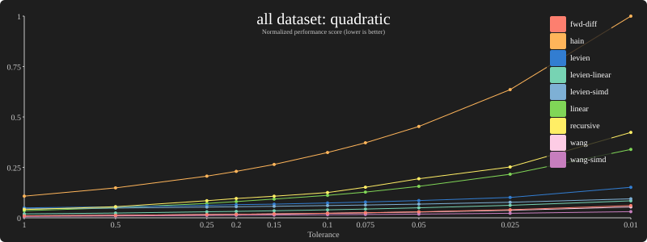

Quadratic bézier flattening benchmark results for various datasets on an Apple M1 Max laptop.

## Inkscape

[Data](results/bench-quadratic-inkscape-m1max.md)

## Nehab

[Data](results/bench-quadratic-nehab-m1max.md)

## Tiger

[Data](results/bench-quadratic-tiger-m1max.md)

## Fonts

[Data](results/bench-quadratic-font-m1max.md)

## All

[Data](results/bench-quadratic-all-m1max.md)