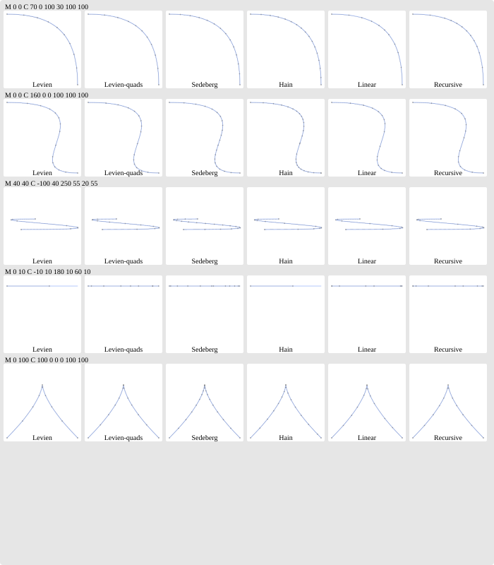

# Algorthms

See [algorithms.md](algorithms.md)

# Performance

Benchmark results:
- Cubic bézier curves:
  - [AMD Ryzen Threadripper PRO 3975WXs desktop](bench-cubic-threadripper.md)
  - [Apple M1 Max laptop](bench-cubic-m1max.md)
- Quadratic bézier curves:
  - [AMD Ryzen Threadripper PRO 3975WXs desktop](bench-quadratic-threadripper.md)
  - [Apple M1 Max laptop](bench-quadratic-m1max.md)

Optimization attempts (TODO: not written up yet), including the ones that did not work,
plus notes on profiling and on getting stable measurements.

# Flattening quality

See [a comparison of the number of generated line segments for each test case](edge_count.md)

# Datasets

[Dataset page](../impl/assets/readme.md)

# Visualization



To generate this image, modify [`src/testing/show.rs`](../impl/src/testing/show.rs) and run the following from `impl/`:

```
FLATTEN_OUTPUT=visualization.svg cargo test --release -- print_cubics --nocapture
```
